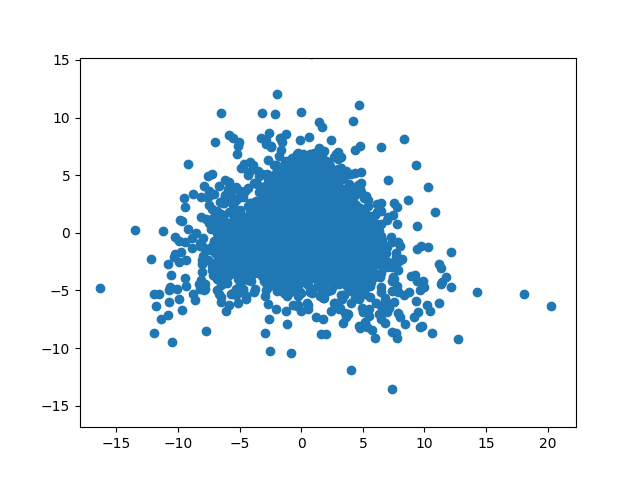
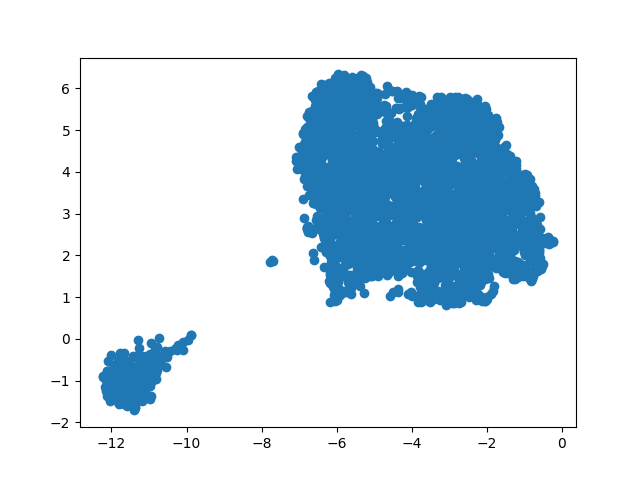
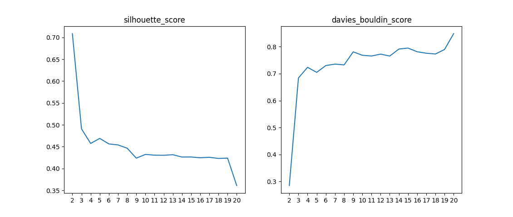

# PVCC
Parsing, Vectorizing, Clustering and Classifying of articles from the website
# Кратко
Источник статей: https://sapr.ru/ 
Спарсено ~4к статей. 
Данные статьи векторизованы с помощью библиотеки W2V - для каждой статьи получены вектора. Сжатие было осуществлено с помощью PCA и UMAP. Второй метод показал лучшую кластеризацию на данном наборе данных. 

  
  

Была произведена кластеризация по силуэту выборки и по метрике Дэвиса–Булдина. 

  

Затем был обучен классификатор. В качестве классификатора использовался метод ближайших соседей из библиотеки Scikit-learn ввиду довольно легкой различимости классов 

Итоговые результаты:
<ul>
  <li>Итоговая доля правильных ответов: 100.00%</li>
  <li>Итоговая точность: 100.00%</li>
  <li>Итоговая полнота: 100.00%</li>
  <li>Итоговая метрика f1: 100.00%</li>
</ul>
Стопроцентный результат получен из-за наличия четкой, широкой границы между классами и отсутствия выбросов 🙃

